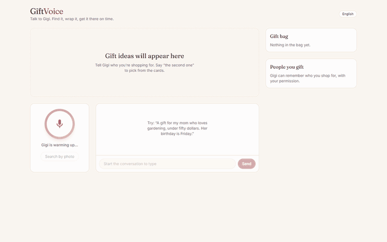
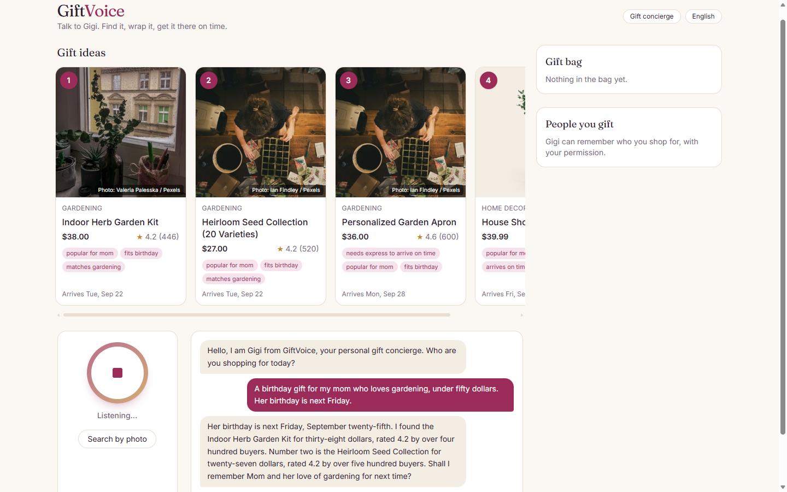
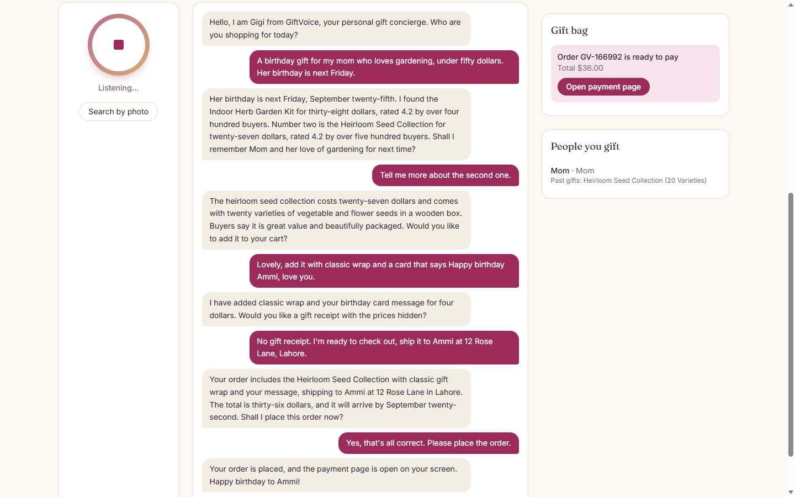
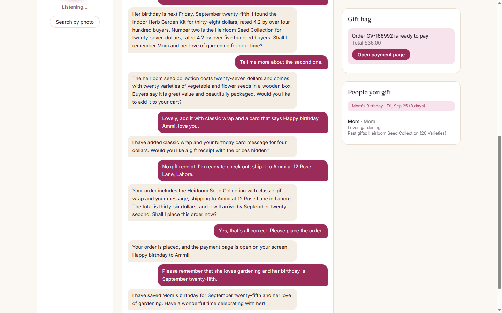
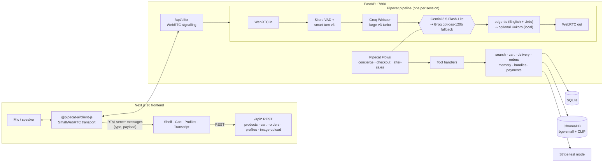

# GiftVoice

A real-time voice shopping concierge for an online gift store. You describe who the gift is for, and it finds grounded picks from the catalog. Products show up on screen and you can refer to them by position ("the second one"). It adds gift wrap and a message, checks whether delivery beats your deadline, and takes you to a test-mode checkout. It also remembers recipients between visits.

It runs entirely on **free resources**: open-source models on the CPU, plus the free tiers of Groq and Google AI Studio.

## Demo



*Recorded in headless Edge with typed turns; the same turns work by voice.*

| Grounded, deadline-aware picks | Read-back before the order | Remembered for next time |
|---|---|---|
| [](docs/search.png) | [](docs/checkout.png) | [](docs/memory.png) |

## Features

**Core**
- Real-time voice over peer-to-peer WebRTC. You can interrupt it; Silero VAD and a local smart-turn model decide when you've finished talking.
- A gift concierge that asks about the recipient, occasion and budget, then gives 2–3 picks, each with a reason.
- Grounded hybrid search: bge-small vectors plus BM25, fused with RRF, then filtered by price, category and delivery time. The agent can only recommend products that exist in the catalog.
- Voice and screen stay in sync: product cards, cart and checkout update live as the agent calls tools.
- Cart and checkout with gift wrap, a message card, a price-hidden receipt and a separate ship-to address. Payment goes through Stripe test mode, or a mock checkout if no key is set.
- Confirmation enforced on the server, not only in the prompt: `create_checkout` first returns a summary (items, wrap, message, address, total, arrival date) for the agent to read back. The order is created only by a later call with `shopper_confirmed=true`, in a *later* shopper turn, for exactly that summary. If the cart or address changed in between, the agent must read it back again.
- Deadline-aware delivery: "before next Friday" is parsed into a date and checked against each product's shipping days. Items that arrive on time with standard shipping rank above slightly better-rated ones that would need paid express, and those show "needs express to arrive on time" first on the card.
- Order tracking, returns, and escalation to a human support ticket.

**Differentiators**
- Recipient memory: remembers people, their interests and past gifts (so it won't repeat a gift) and upcoming occasions. It asks permission first, and a checkout for "Mom" and a later "remember Ammi's birthday" merge into one profile instead of creating duplicates. The people panel and upcoming-occasion chips update live.
- Budget bundle builder that fills a gift basket up to a total.
- Photo search: upload a photo and CLIP finds visually similar products.
- Urdu/English: Whisper auto-detects the language (spoken Urdu that it labels as Hindi is transcribed again as Urdu), and any sentence in Urdu script is spoken with an Urdu edge-tts voice.
- Specialist agents via Pipecat Flows (gift concierge → checkout → after-sales), each seeing only the tools it needs.
- Tone awareness: the agent notes the shopper's mood (rushed, hesitant, frustrated…), shortens or softens its replies, and shows the mood in the UI.
- Resilience and latency on free tiers:
  - Free-tier Gemini usually starts streaming within 1–2 s, but some requests sit silent for 7–10 s. A request with no first chunk after 3 s is re-issued.
  - If the stream is still silent after 8 s, or Gemini returns a 429/quota/server error, the same turn is answered by Groq gpt-oss-120b, and Gemini is tried again after 60 s.
  - A stalled edge-tts stream is retried after 4 s. With the optional Kokoro engine, failures fall back to edge-tts.
  - VAD waits 0.6 s of silence before ending a turn, so ordinary pauses don't split a sentence into fragments that Whisper mis-hears.
  - If the backend is still loading its models when you press the orb, the UI shows "Gigi is warming up" and connects once the health check passes, instead of failing.
- A latency badge per turn: speech-to-text, LLM first token, TTS first audio, and end-to-end.

## Architecture



| Layer | Choice |
|---|---|
| Voice framework | Pipecat 1.10 + SmallWebRTCTransport, Pipecat Flows |
| Turn taking | Silero VAD + local smart-turn v3 (CPU) |
| Speech-to-text | Groq `whisper-large-v3-turbo` (free tier) |
| LLM | Gemini 3.5 Flash-Lite (free tier), Groq `openai/gpt-oss-120b` fallback |
| Text-to-speech | edge-tts (free Microsoft neural voices, English + Urdu) · Kokoro-82M ONNX (local) as an opt-in |
| Search | `BAAI/bge-small-en-v1.5` + CLIP ViT-B/32 in ChromaDB, BM25, RRF |
| Data | SQLite |
| Catalog | DummyJSON products and photos + curated gift items with Pexels photos |
| Frontend | Next.js 16, React 19, Tailwind v4 |

## Setup

Requirements: Python 3.12, Node 20+ (both can come from conda), about 3 GB of disk for models.

```bash
conda create -n giftvoice python=3.12 nodejs -c conda-forge
conda activate giftvoice
pip install uv
cd backend
uv pip install -r requirements.txt --index-url https://pypi.org/simple --extra-index-url https://download.pytorch.org/whl/cpu --index-strategy unsafe-best-match
```

Copy `.env.example` to `.env` and add the free keys:

| Key | Where | Needed for |
|---|---|---|
| `GROQ_API_KEY` | console.groq.com/keys | Required: speech-to-text and fallback LLM |
| `GOOGLE_API_KEY` | aistudio.google.com/apikey | Recommended: primary LLM |
| `PEXELS_API_KEY` | pexels.com/api | Optional: real photos for curated items (placeholders otherwise) |
| `STRIPE_SECRET_KEY` | Stripe dashboard, test mode `sk_test_…` | Optional: the built-in mock checkout is used otherwise |

Seed the catalog (run from `backend/`):

```bash
python -m scripts.seed_catalog
```

Optional: to use local Kokoro TTS, download the model and set `TTS_ENGINE=kokoro` in `.env`. On a laptop CPU it needs 3–5 s per sentence against about 1 s for edge-tts, so edge-tts is the default.

```bash
python -m scripts.download_models
```

Run the backend (from `backend/`):

```bash
uvicorn app.main:app --port 7860
```

Run the frontend (from `frontend/`):

```bash
npm install && npm run dev
```

Open http://localhost:3000 and press the orb. Chrome or Edge is recommended; allow microphone access.

## Try saying

- "I need a birthday gift for my mom. She loves gardening, under fifty dollars, and her birthday is Friday."
- "Tell me more about the second one." / "Compare the first two."
- "Put together a self-care basket for about eighty dollars."
- "Add gift wrap and a card saying happy birthday, love you." then "Ship it to her place in Austin."
- "Where's my order?" / "I want to return it."
- "کیا آپ اردو میں بات کر سکتے ہیں؟" (switches the voice to Urdu)
- Upload a photo: "find something that looks like this."

## Tests and benchmarks

Run these from `backend/`. The tests cover tool handlers, delivery-date parsing, bundles, cart math and scripted multi-turn conversations:

```bash
python -m pytest -q
```

Time to first audio for Kokoro vs edge-tts:

```bash
python -m scripts.bench_tts
```

## Project layout

```
backend/
  app/main.py                FastAPI app, WebRTC signalling, static images
  app/api.py                 REST endpoints for the UI
  app/agent/pipeline.py      Pipecat pipeline, LLM/TTS failover, latency observer
  app/agent/flows.py         Specialist nodes and transitions (Pipecat Flows)
  app/agent/tools.py         Tool schemas and handlers shared by all nodes
  app/agent/prompts.py       Persona and per-node instructions
  app/agent/edge_tts_service.py  Streaming edge-tts service (MP3 → PCM via PyAV)
  app/services/              search, cart, delivery, orders, memory, bundles, payments
  scripts/                   seed_catalog, download_models, bench_tts
  tests/
frontend/
  src/lib/useGiftVoice.ts    Pipecat client hook: transcript, server events, UI state
  src/components/            VoiceOrb, Transcript, ProductShelf, CartPanel, ProfilesPanel
  src/app/                   Main page, mock checkout, order status
```

## Notes on the free tiers

- Google may use free-tier Gemini prompts to improve its products. Don't put real personal data through it.
- edge-tts is an unofficial client for Microsoft Edge's read-aloud voices. It's fine for demos, but not something to rely on in production.
- Curated product photos come from Pexels, and each card credits the photographer.
